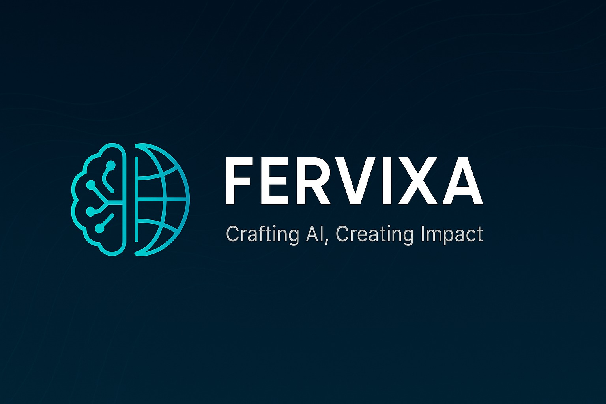

<!-- Banner -->

  

<h1 align="center">✨ Fervixa ✨</h1>
<h3 align="center">Crafting AI, Creating Impact</h3>

---

## 👋 Who We Are  
We’re **Zohaib** & **Anoosha**, two passionate developers on a mission to **reshape the web** and **build the next generation of AI agents**.  
We founded **Fervixa** to combine our love for **AI, web development, and freelancing** into one powerful vision.

---

## 🚀 What Drives Us
- 🤖 **AI Agents** – Smart, autonomous, and designed for real-world problem solving.
- 🌐 **Web Platforms** – Fast, modern, and scalable web applications.
- 💼 **Freelancing Excellence** – Delivering impactful solutions for startups & enterprises.

---

## 🛠 Our Toolbox  

  

---

## 🌱 What’s Next?  
- Building our **first wave of AI agents** 🚀  
- Taking on **select freelance projects** to empower businesses worldwide.  
- Growing **Fervixa** into a brand known for **innovation & excellence**.

---

## 🤝 Let’s Connect  

  
  
  

---

### 🌟 *Follow our journey as we build, learn, and create the future.*
